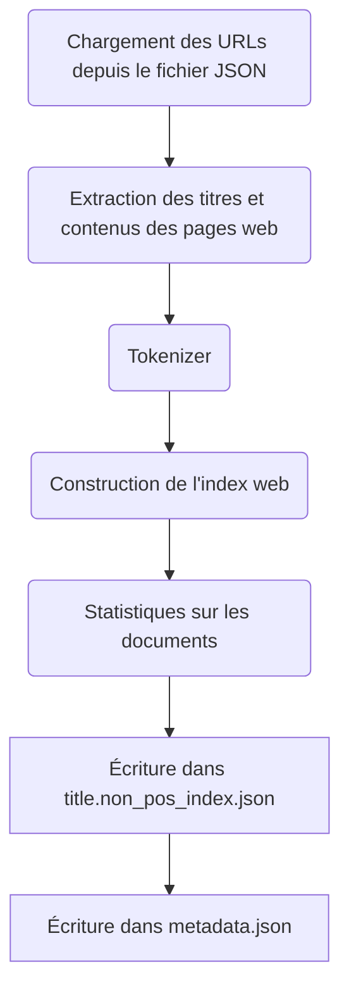

# web-index

```mermaid
graph TD;
    A(Chargement des URLs depuis le fichier JSON) --> B(Extraction des titres et contenus des pages web)
    B --> C(Tokenizer)
    C --> D(Construction de l'index web)
    D --> E(Statistiques sur les documents)
    E --> F[Écriture dans title.non_pos_index.json]
    F --> G[Écriture dans metadata.json]

```
