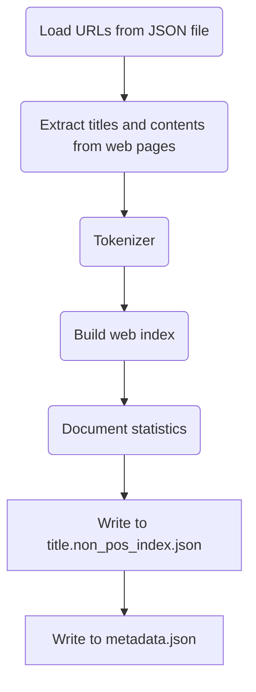

# IndexCraft

## Overview

IndexCraft is a Python project for constructing a minimal non-positional web index from a JSON list of URLs generated by a web crawler. It extracts titles, tokenizes them, and builds the index. Before indexing, it computes document statistics including document count, total token count, per-field token count, and average tokens per document. The program outputs the index to title.non_pos_index.json and the statistics to metadata.json.



## Getting Started

To begin, clone the repository:

```bash
git clone https://github.com/odi77/web-index.git
cd web-index
```

Next, set up a virtual environment

```python
python3 -m venv venv
source venv/bin/activate
pip install -r requirements.txt
```

Once the environment is set up, run the app through the command line interface (CLI). Explore the available options using the following command:

```bash
# get some help
python3 main.py --help
# run the Non-positional index (Default)
python3 main.py
# run the positional index
python3 main.py --pos_idx
```

## Contributors
[Cyrille NEBANGA](https://github.com/odi77)
